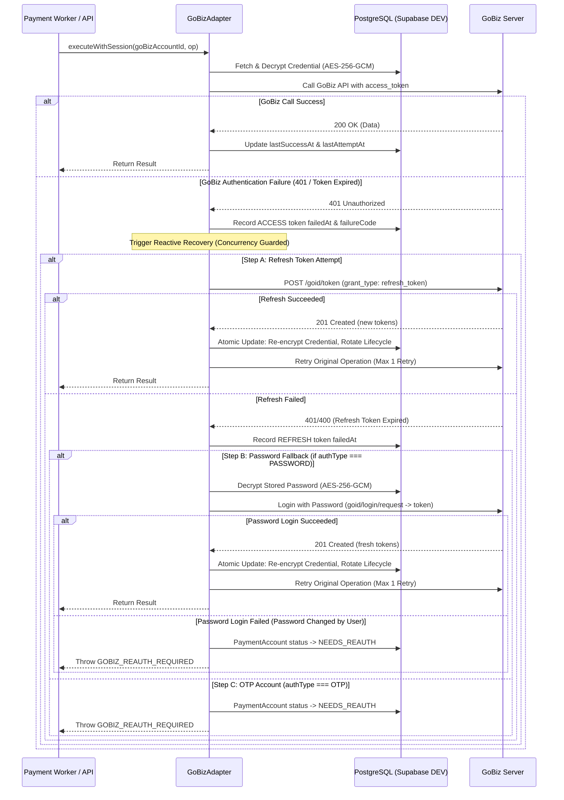

# NEETPAY V1 - GOBIZ INTEGRATION, SESSION RELIABILITY & LIFECYCLE TRACKING SPECIFICATION

**Version:** 1.0.0  
**Status:** IMPLEMENTED & VERIFIED  
**Database:** Supabase DEV PostgreSQL  

---

## 1. No Fixed Expiry Assumption & JWE Architecture

GoBiz Web Dashboard authentication tokens (`POST https://api.gobiz.co.id/goid/token` with `client_id: go-biz-web-new`) have the following technical properties:

1. **No `expires_in` Field**: GoBiz does NOT return `expires_in` in its OAuth2 token response body.
2. **Encrypted JWE Structure**: Tokens are structured as JSON Web Encryption (JWE) with header `alg: "dir"`, `enc: "A128GCM"`, `zip: "DEF"`. Because payloads are encrypted using Gojek internal symmetric server keys, expiration timestamps (`exp`) cannot be decoded on client/third-party servers.
3. **Strict No-Assumption Principle**:
   - NeetPay does **NOT** assume access tokens last 24 hours, 3 days, or 30 days.
   - NeetPay does **NOT** assume refresh tokens last indefinitely or run timers based on guess values.
   - Database field `credentialExpiresAt` remains `null` for authentic GoBiz tokens.

---

## 2. Reactive Auto-Refresh Architecture

Instead of arbitrary timer-based refreshing, NeetPay uses a centralized reactive session recovery adapter ([`GoBizAdapter`](file:///D:/project%20web/NEETpay/backend/src/providers/gobiz/gobiz.adapter.ts)):



---

## 3. Authentication Types & Fallback Flows

NeetPay supports two distinct onboarding mechanisms:

### A. `authType = OTP` (SMS OTP to Owner Phone)
- Onboarding requires `phoneNumber` $\rightarrow$ `requestOtp` $\rightarrow$ 4-digit SMS OTP $\rightarrow$ `verifyOtp`.
- **OTP is NEVER stored**.
- When `access_token` and `refresh_token` both fail:
  - Account status transitions to `NEEDS_REAUTH`.
  - `PaymentAccount`, `GoBizAccount`, `qrString`, and token histories are **PRESERVED** (never deleted).
  - User performs a quick 1-step OTP reconnect from dashboard.

### B. `authType = PASSWORD` (Email & Password)
- Onboarding requires GoBiz login email & password.
- Password is **encrypted using AES-256-GCM** and stored in `GoBizAccount.encryptedPassword`.
- **Disclosure Requirement**:
  > *"Password GoBiz disimpan dalam bentuk terenkripsi dan hanya digunakan untuk menghubungkan ulang akun GoBiz secara otomatis jika access token dan refresh token tidak dapat digunakan."*
- When `access_token` and `refresh_token` fail:
  - Adapter automatically triggers password re-login fallback in background.
  - Generates fresh token pair and seamlessly resumes operations without merchant downtime.

---

## 4. Token Lifecycle Tracking & Observed Lifetimes

Every token transition is recorded in `gobiz_token_lifecycles` using SHA-256 fingerprints.

### Model Schema: `GoBizTokenLifecycle`
```prisma
model GoBizTokenLifecycle {
  id               String          @id @default(cuid())
  goBizAccountId   String
  tokenType        GoBizTokenType  // ACCESS | REFRESH
  tokenFingerprint String          // SHA-256(rawToken)
  issuedAt         DateTime        @default(now())
  lastSuccessAt    DateTime?
  lastAttemptAt    DateTime?
  failedAt         DateTime?
  replacedAt       DateTime?
  failureCode      String?
  createdAt        DateTime        @default(now())
  updatedAt        DateTime        @updatedAt

  goBizAccount GoBizAccount @relation(fields: [goBizAccountId], references: [id], onDelete: Cascade)
}
```

### Metrics Calculated from Observed Data:
1. **Active Age**:
   $$\text{Active Age} = \text{now} - \text{issuedAt}$$
2. **Observed Token Lifetime**:
   $$\text{Observed Lifetime} = \text{failedAt} - \text{issuedAt}$$
3. **Usage Lifespan**:
   $$\text{Usage Lifespan} = \text{lastSuccessAt} - \text{issuedAt}$$

> [!IMPORTANT]
> **Zero Secrets in Lifecycle Table**: Raw tokens, passwords, OTPs, and authorization headers are STRICTLY FORBIDDEN from the lifecycle table. Only 64-character hex SHA-256 fingerprints are stored.

---

## 5. Concurrency Protection

To prevent race conditions where concurrent transaction checks trigger simultaneous refresh token rotations:
- In-memory Promise deduplication map keyed by `goBizAccountId` ensures only **1 recovery promise** runs at any given instant per account.
- Parallel requests await the shared recovery promise and proceed with the freshly rotated token.

---

## 6. Base QRIS String Protection

- Base static QRIS (`qrString`) is extracted directly from `https://portal.gofoodmerchant.co.id/id/dashboard` (`aspi_qr_string`) upon account connection.
- Existing `qrString` is **NEVER overwritten with null** during transient portal sync errors or failed token refreshes.
